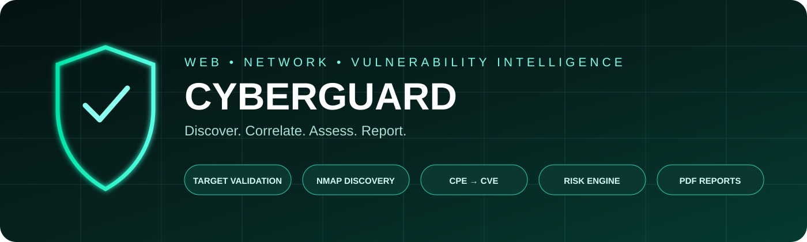
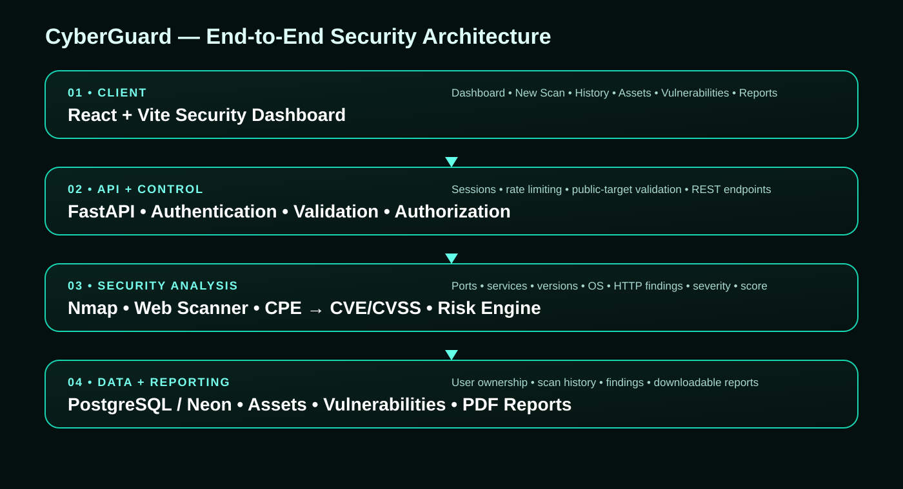

  

🛡️ Discover • Correlate • Assess • Report

⚡ CyberGuard in one view

CyberGuard is a web-based cybersecurity assessment platform combining target validation, network discovery, web assessment, service identification, CPE/CVE/CVSS intelligence, risk analysis, asset management and professional reporting in one workflow.

Target → Validate → Scan → Discover → Identify → Correlate → Assess → Report

🧠 Security intelligence pipeline

             ┌──────────────┐
             │    TARGET    │
             └──────┬───────┘
                    ↓
          ┌────────────────────┐
          │ Public Target Check│
          └─────────┬──────────┘
                    ↓
       ┌────────────┼────────────┐
       ↓            ↓            ↓
   Full Scan    Web Scan     Port Scan
       │            │            │
       └────────────┼────────────┘
                    ↓
          Services / Products
                    ↓
                CPE Mapping
                    ↓
             CVE + CVSS Data
                    ↓
              Risk Engine
                    ↓
        Score • Grade • Risk Level
                    ↓
      Assets • Vulnerabilities • Reports

🏗️ Architecture

🚀 Core capabilities

Module

Capability

🔍 Full Scan

Combined security assessment workflow

🌐 Web Scan

HTTP, headers, server metadata and findings

🛰️ Port Scan

TCP discovery, services, products and versions

🧩 Vulnerability Intelligence

CPE → CVE → CVSS correlation

📊 Risk Engine

Security score, grade and risk level

🖥️ Assets

Discovered asset organization

🛡️ Vulnerabilities

Searchable CVE details and severity information

📄 Reports

Detailed interactive reports and PDF export

🔐 Authentication

Session-based authentication and user isolation

🔐 Security by design

CyberGuard uses a layered approach:

Frontend validation
       ↓
Backend target validation
       ↓
Authentication
       ↓
Authorization / ownership
       ↓
Controlled scanner execution
       ↓
Structured storage

Private/local destinations such as common private IP ranges, loopback and localhost names are rejected before scanning.

Authentication uses password hashing, HTTP-only session cookies, session expiration and login rate limiting.

📊 From raw scanner output to a security report

CyberGuard transforms technical results into readable security information:

RAW DISCOVERY
      ↓
SERVICE + VERSION
      ↓
CPE
      ↓
CVE / CVSS
      ↓
SEVERITY
      ↓
RISK
      ↓
RECOMMENDATIONS
      ↓
PDF REPORT

A CPE match is vulnerability intelligence, not proof that every returned CVE is exploitable on the exact target. Applicability may depend on configuration, modules, platform and other conditions.

🧰 Technology Stack

React Vite FastAPI Python SQLAlchemy PostgreSQL Neon Nmap CPE CVE CVSS ReportLab Vercel

☁️ Deployment

React + Vite ───────→ Vercel
       │
       │ REST API
       ↓
FastAPI ────────────→ Vercel
       │
       ↓
PostgreSQL / Neon

✅ Project status

Phase 1 — Complete

Authentication • User isolation • Full Scan • Web Scan • Port Scan • Nmap • CPE/CVE/CVSS • Risk Engine • Assets • Vulnerabilities • Scan History • Reports • PDF Export • Vercel Deployment

🧪 Authorized testing

Nmap provides a dedicated public test target for learning:

scanme.nmap.org

Example:

nmap -p 80,443 -sT -sV scanme.nmap.org

Only scan systems for which you have explicit authorization.

🧭 Roadmap

Background workers · Scan scheduling · Scan comparison · Remediation tracking · Compliance reporting · SIEM integrations · Continuous authorized monitoring

⚠️ Responsible use

CyberGuard is intended for authorized, non-destructive security assessment. Never scan websites, hosts, networks or applications without permission from the owner.

🛡️ CYBERGUARD

Discover • Correlate • Assess • Report

